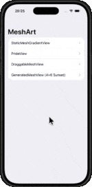

# MeshArt Meets Siri and Shortcuts  

MeshArt now gets even smarter: in this code-along, you’ll learn how to extend your app with **App Intents**, Apple’s framework for making your app’s actions available to **Siri, Shortcuts, and Spotlight**. Imagine saying:  

> “Hey Siri, generate a 4×6 mesh with sunset colors.”  

…and watching your app open directly into the generated gradient.  

  

## Overview  

Building on the original [MeshArt project](https://github.com/swiftandcurious/MeshArt), this extended version introduces **App Intents** to let MeshArt respond to voice and automation. Inspired by WWDC24’s [Meet App Intents](https://developer.apple.com/videos/play/wwdc2024/10189) and Apple’s push toward system-wide intelligence, this project demonstrates:  

- **Defining an AppEnum (`Palette`)** to expose color choices like *Sunset*, *Forest*, and *Neon* to Siri and Shortcuts.  
- **Creating your first App Intent (`GenerateMeshIntent`)** with parameters for rows, columns, and palette.  
- **Connecting Intents to SwiftUI** using a shared controller and `AppDependencyManager`.  
- **Automatic navigation:** your app opens directly into the generated mesh view when the intent runs.  
- **GeneratedMeshView:** renders gradients from Siri/Shortcut parameters, with optional draggable control points for creative tweaking.  

## Features  

- **Voice-powered MeshArt:** Launch gradients directly with Siri commands or Shortcuts.  
- **Custom Palette Enum:** Nine curated color themes (Sunset, Ocean, Forest, Desert, Aurora, Lava, Galaxy, Pastel, Neon).  
- **GeneratedMeshView:** Dynamically renders rows × columns meshes using App Intent parameters.  
- **Optional Interactivity:** Drag control points live to reshape the mesh.  
- **Seamless Navigation:** App opens to the right view every time, even with repeated Shortcut runs.  

## Installation  

1. Clone the Repository:  
   ```bash
   git clone https://github.com/swiftandcurious/MeshArtAppIntent.git
   ```
2. Open in Xcode:
    - Open the MeshArt.xcodeproj.
    - Requires **Xcode 15 or later** and **iOS 17+** for App Intents support.
3. Run the App:
    - Select your target device or simulator.
    - Build and run with **Cmd + R** or the Play button.
4. Test the Intent:
    - Open the **Shortcuts** app on your device.
    - Add the action **Generate Mesh**.
    - Set rows, columns, and palette, then run — the app opens right into your generated gradient.
    
## Usage

Once the app is running, explore these views:

- **StaticMeshGradientView** – a simple 3×3 gradient.
- **PrideView** – bold text with pride-flag stripes using mesh gradients.
- **DraggableMeshView** – interactive control points with color pickers.
- **GeneratedMeshView** – created from Siri/Shortcuts parameters, with optional draggable control points.
    
## License

MeshArt Meets Siri and Shortcuts is available under the [MIT License](LICENSE).

## Acknowledgements

- **WWDC24 Inspiration:** [Meet App Intents](https://developer.apple.com/videos/play/wwdc2024/10189) and [Create custom visual effects with SwiftUI](https://developer.apple.com/videos/play/wwdc2024/10151).
    
- **Apple Developer Documentation:** for App Intents, SwiftUI MeshGradient, and Shortcuts integration.
    

---

**Stay hungry. Stay foolish.**

— _Steve Jobs_
